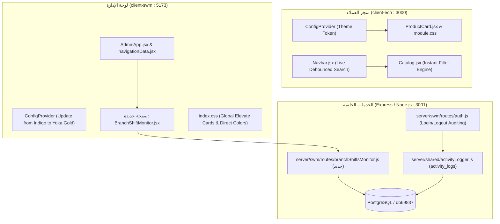

# خطة التنفيذ الفنية والشاملة لتطوير منصة يوكا ستور (Yoka Platform)

---

## 📌 الملخص التنفيذي وأهداف المشروع

تهدف هذه الخطة إلى تحويل تجربة الاستخدام في منصة **يوكا ستور (Yoka Store)** بمكونيها:
1. **متجر العملاء الإلكتروني (`client-ecp`)**
2. **لوحة التحكم وإدارة الفروع والمستودعات (`client-swm`)**
3. **الخادم والخدمات الخلفية (`server/swm` & `server/ecp`)**

من خلال ثلاث ركائز رئيسية:
1. **الهوية البصرية الفاخرة للعلامة التجارية (Brand-Aligned Luxury UI & Elevated Cards)**:
   - توحيد منظومة الألوان لتماثل الشعار الذهبي المعدني ليوكا ستور (`#C8A45C` / `#DFCA95` / `#B38E46`) مع خلفيات الأسود الملكي (`#0A0A0A` / `#0F172A`).
   - استبدال اللون النيلي (`Indigo #4F46E5`) في لوحة الإدارة بهوية يوكا الذهبية الرسمية.
   - إزالة الظلال الضبابية والتدريجات الباهتة من الألوان الصريحة (مثل اللون الأحمر `Direct Solid Red #DC2626` بدون هالات أو تدرج وردي).
   - تأثير البطاقات المرتفعة عند التمرير: تضخيم سلس للبطاقة (`scale(1.025)` مع رفع `translateY(-6px)`)، وانقلاب خلفية البطاقة إلى **الأسود الفاحم (Black Cards BG) مع نصوص وأيقونات ذهبية نقية (Gold Text)** حصرياً عند الـ Hover.
2. **البحث اللحظي والتصفية الفورية (Real-Time Search & Instant UI Reactivity)**:
   - التخلص تماماً من الحاجة للضغط على أزرار مثل "تطبيق الفلاتر" أو إعادة تحميل الصفحة أو الضغط على زر Enter.
   - تفعيل محرك بحث ذكي لحظي ومربوط بـ Debounce (250ms–300ms) على حقول البحث وتحديث مباشر فوري مع أي تغيير في شرائح الأسعار، خيارات المقاسات، الألوان، التصنيفات، والترتيب، مع مزامنة الـ URL بدون وميض أو إعادة تحميل.
3. **صفحة مراقبة الورديات وعمليات فتح وإغلاق الفروع (Shift Tracking & Store Operations Monitor)**:
   - إنشاء صفحة إدارية جديدة في لوحة التحكم لمراقبة تواجد الموظفين ومواعيد تسجيل الدخول والخروج (`Login / Logout Activity`) لكل فرع ومستخدم.
   - مراقبة حالة فتح وإغلاق الفروع التجارية ونقاط البيع (`Store Open / Close Status`) لحظياً، وحركات ورديات الكاشير (`pos_shifts`)، والعجز والزيادة، وعمليات الجرد المالي والترحيل للخزينة.

---

## 🏗️ البنية المعمارية والمكونات المستهدفة



---

## 📋 مراحل التنفيذ التفصيلية (Phased Implementation Plan)

---

### المرحلة الأولى: توحيد الهوية البصرية والبطاقات الفاخرة (Brand Identity & Elevated Cards)

#### 1.1 لوحة ألوان الهوية البصرية (Yoka Brand Palette Token System)
- **الألوان المعتمدة المستخرجة من لوجو يوكا ستور الذهبي الرسمي**:
  - `Gold Primary (الذهبي الرئيسي)`: `#C8A45C`
  - `Gold Light (الذهبي الفاتح / لمعان المعدن)`: `#DFCA95`
  - `Gold Metallic (الذهبي اللامع)`: `#D4AF37`
  - `Gold Dark (الذهبي العميق للحدود والأزرار النشطة)`: `#B38E46`
  - `Black Luxury Canvas (الأسود الملكي)`: `#0B0F17` / `#0A0A0A`
  - `Direct Solid Red (الأحمر الصريح المباشر)`: `#DC2626` (بدون تدرج وبدون ظلال ضبابية أو هالات وردية)
  - `Direct Solid Green (الأخضر الصريح)`: `#16A34A`
  - `Direct Solid Amber (البرتقالي/الكهرماني الصريح)`: `#D97706`

#### 1.2 الخطوات الفنية في لوحة التحكم (`client-swm`):
1. **تحديث `client-swm/src/main.jsx`**:
   - استبدال `colorPrimary: '#4F46E5'` باللون الذهبي الملكي `#C8A45C`.
   - تعديل ألوان الروابط، علامات التبويب (`Tabs.inkBarColor`), والأزرار الرئيسية لتتبع الهوية.
2. **تحديث `client-swm/src/index.css`**:
   - استبدال متغيرات الـ `:root` الخاصة بـ `--color-admin-primary` من الأزرق النيلي إلى درجات الذهب الملكي:
     ```css
     --color-admin-primary:   #C8A45C;
     --color-admin-primary-h: #B38E46;
     --color-admin-primary-s: rgba(200, 164, 92, 0.12);
     --color-admin-primary-b: rgba(200, 164, 92, 0.35);
     ```
   - توحيد أزرار بوابات تسجيل الدخول (`.auth-portal-btn.active-admin`) لتتألق باللون الذهبي والأسود الملكي.

#### 1.3 معالجة الألوان الصريحة (Direct Red & Clear Colors):
- استبدال أي شارات أو نصوص حمراء كانت تستخدم `box-shadow` ملون أو `background: linear-gradient`:
  - شارات التنبيه، بطاقات الخصم، أزرار الحذف، وحالات عدم التوفر تصبح بلون مسطح ناصع:
    ```css
    /* Direct Solid Red Standard */
    .direct-danger-badge, .badge-danger, .btn-danger {
      background: #DC2626 !important;
      color: #FFFFFF !important;
      border: 1px solid #B91C1C !important;
      box-shadow: none !important;
      text-shadow: none !important;
    }
    ```

#### 1.4 هندسة تأثير البطاقات الفاخرة المرتفعة (Elevated Cards with Black BG & Gold Text on Hover):
- **المبدأ**: الوضع الطبيعي للبطاقة هو سطح فاخر ونظيف (أبيض مع حدود دقيقة). عند تحريك مؤشر الفأرة فوق البطاقة (`:hover`):
  1. ترتفع وتكبر بسلاسة: `transform: translateY(-6px) scale(1.025);`
  2. تنقلب الخلفية فورياً إلى اللون الأسود الملكي: `background: #0B0F17 !important;`
  3. تنقلب النصوص، العناوين، والأسعار إلى اللون الذهبي المضيء: `color: #DFCA95 !important;` أو `#C8A45C !important;`
  4. تتحول الحدود إلى إطار ذهبي رفيع أنيق: `border-color: #C8A45C !important;`
  5. الأزرار الداخلية والكبسولات تنقلب لتنسجم مع المشهد الليلي الذهبي.
- **تطبيق التأثير على**:
  - `ProductCard.module.css` (بطاقات المنتجات في المتجر)
  - `.category-card` (بطاقات الأقسام والتصنيفات)
  - `.trust-feature-card` (بطاقات مميزات الثقة)
  - `.quick-action-card` (بطاقات الوصول السريع في لوحة التحكم)
  - `.pos-nav-hero-card` (بطاقات العمليات في الـ POS)

---

### المرحلة الثانية: التفاعل اللحظي والبحث الفوري (Real-Time Search & Instant UI Reactivity)

#### 2.1 مشكلة التصميم الحالية والحل البرمجي:
- **الوضع الحالي**: المستخدم يضطر لكتابة البحث ثم الضغط على مفتاح Enter أو النقر على "تطبيق الفلاتر". تعديل السلايدر الخاص بالأسعار أو المقاسات لا ينعكس إلا بضغطة زر.
- **الحل الجديد**: تطبيق تفاعل فوري بزمن استجابة فائق (Instant Reactivity) مع حماية الخادم من كثرة الطلبات عبر Debouncing ذكي.

#### 2.2 الخطوات الفنية في متجر العملاء (`client-ecp`):
1. **خطاف البحث اللحظي (`useDebounce.js`)**:
   - إنشاء خطاف مخصص `client-ecp/src/hooks/useDebounce.js` لتأخير نداء الـ API لحقول الكتابة (مثل البحث باسم المنتج أو الماركة) بمقدار **280 ميلي ثانية**.
2. **تحديث `client-ecp/src/pages/Catalog.jsx`**:
   - إزالة زر "تطبيق الفلاتر" (أو تحويله لمؤشر شكلي لحالة التصفية في الشاشات الصغيرة).
   - ربط فلاتر:
     - `search` (مباشر عبر `debouncedSearch`)
     - `categoryId` (فوري بمجرد الاختيار أو النقر على الشريحة)
     - `brand` (مباشر عبر `debouncedBrand`)
     - `priceRange` (فوري عبر حدث `onChangeComplete` لمكون `Slider` من Ant Design)
     - `size` و `color` (فوري بمجرد النقر على الشريحة)
     - `sort` (فوري بمجرد التغيير)
   - استدعاء `fetchProducts(1)` آلياً في `useEffect` يستمع لجميع متغيرات الفلترة دون أدنى تدخل يدوي من المستخدم.
   - تحديث رابط المتصفح (`useSearchParams`) تلقائياً ومزامنة تاريخ التصفح لدعم زر الرجوع (Back/Forward).
3. **تحديث شريط البحث في الـ Navbar (`client-ecp/src/components/Navbar.jsx`)**:
   - تفعيل الإرسال اللحظي والمقترحات السريعة عند البحث.
4. **تحديث إدارة المخزون والأصناف في لوحة التحكم (`client-swm` / `Products.jsx` & `POS.jsx`)**:
   - تطبيق `useDebounce` على حقول البحث بالاسم أو الكود لتحديث الجدول تلقائياً بدون الحاجة للضغط على زر إنتر.

---

### المرحلة الثالثة: صفحة مراقبة الورديات وعمليات فتح وإغلاق الفروع (Shift Tracking & Store Operations Monitor)

#### 3.1 الهدف الوظيفي:
إتاحة لوحة تحكم رقابية وتنفيذية حية وشاملة للإدارة العامة لمراقبة:
1. **حالة فتح وإغلاق الفروع التجارية ونقاط البيع (`Store Open / Close Live Status`)**.
2. **سجل حركات تسجيل الدخول والخروج (`User & Branch Login/Logout Timeline`)** وتفاصيل كل جلسة.
3. **سجل الورديات المالية (`POS Shifts`)** ومطابقة النقدية مع العجز والزيادة والترحيل للخزينة.

#### 3.2 البنية البرمجية في الخادم الخلفي (`server/swm`):
1. **تحسين تسجيل الخروج في `server/swm/routes/auth.js`**:
   - تعديل نقطة النهاية `POST /api/auth/logout` لاستقبال بيانات المستخدم/الفرع وتسجيل عملية `LOGOUT` رسمياً في جدول `activity_logs`.
2. **إنشاء مسار API مخصص: `server/swm/routes/branchShiftsMonitor.js`**:
   - **الرابط الأساسي**: `/api/swm/branch-shifts-monitor`
   - **صلاحيات الوصول**: مقيد لـ `super_admin`, `admin`, أو من يمتلك صلاحية `perm_daily_shift` / `perm_branches`.
   - **النقاط البرمجية المتاحة**:
     1. `GET /live-status`: يعرض جميع فروع التجزئة (`branches`) مع مؤشر حي لحالة الفرع (مفتوح / مغلق)، اسم الكاشير في الوردية النشطة، وقت فتح الفرع، ورصيد الخزينة والدرج.
     2. `GET /sessions-log`: سجل تاريخي وجدول فلترة لعمليات تسجيل الدخول والخروج مع حساب مدة الجلسات.
     3. `GET /shifts-audit`: استعلام موسع لجدول `pos_shifts` مربوط بأسماء الموظفين، المبيعات، العجز/الزيادة، ونوع الإغلاق.
     4. `GET /operations-kpis`: بطاقات مؤشرات أداء: إجمالي الفروع العاملة الآن، الورديات المفتوحة، والمبيعات اللحظية.

#### 3.3 الواجهة الأمامية الجديدة في لوحة الإدارة (`client-swm`):
1. **إنشاء الصفحة: `client-swm/src/pages/BranchShiftMonitor.jsx`**:
   - تتضمن 4 تبويبات تفاعلية مصممة بالهوية الذهبية والأسود الفاخر:
     - **تبويب 1: لوحة الفروع الحية (Live Store Status Grid)**
     - **تبويب 2: سجل تسجيل الدخول والخروج (Login & Logout Audit)**
     - **تبويب 3: سجل الورديات والإغلاقات (Shifts & Reconciliation)**
     - **تبويب 4: تقرير الالتزام بمواعيد العمل (Branch Operations Adherence)**
2. **دمج الصفحة في هيكل التوجيه والقائمة الرئيسية (`client-swm`)**:
   - تسجيل المسار في `client-swm/src/App.jsx`:
     `<Route path="branch-shifts" element={<BranchShiftMonitor />} />`
   - إضافة المسار في `client-swm/src/pages/admin/navigationData.jsx` في الأقسام المخصصة.

---

### المرحلة الرابعة: الاختبار الشامل، تأكيد الاستقرار وعدم التأثير على العمليات الحالية (QA & Zero Regression)

#### 4.1 خطة حماية الأنظمة الحالية (Regression Protection):
- عدم تعديل الجداول الأساسية أو تغيير منطق الحسابات المالية الحساسة لـ `shiftClosingService.js`.
- الحفاظ على كامل مسارات الـ POS والبيع وإصدار الفواتير دون أي تداخل في دورة البيانات.
- الاعتماد على `activity_logs` الحالي المبرمج بتقنية Non-blocking Fire-and-forget لضمان عدم تأخير استجابة طلبات تسجيل الدخول.

#### 4.2 مصفوفة التحقق والاختبار (Verification Checklist):
| البند | معيار النجاح الفني | الأثر على النظام |
| :--- | :--- | :--- |
| **الهوية الذهبية** | ظهور درجات الذهب والشعار المعتمد في المتجر ولوحة الإدارة مع إزالة الأزرق النيلي. | شكلي فقط / تحسين تجربة العلامة |
| **اللون الأحمر الصريح** | ظهور اللون الأحمر `#DC2626` ناصعاً ومسطحاً في شارات الخصم وحالات النفاذ وأزرار الحذف دون أي تدريج أو ظلال. | تصميمي وتجربة بصرية نقية |
| **تكبير وانقلاب البطاقات** | تكبير البطاقة عند الـ Hover وانقلاب خلفيتها للأسود الفاحم مع تحول النصوص والأسعار للذهبي اللامع. | تأثير CSS نقي فائق السرعة عبر تسريع كارت الشاشة (GPU) |
| **البحث اللحظي والتصفية** | استجابة فورية (280ms) لتعديل البحث وفلاتر الأسعار والمقاسات والأقسام في الكتالوج دون أزرار أو إعادة تحميل. | تجربة مستخدم فورية وتقليل الاستعلامات غير المجدية |
| **صفحة مراقبة الورديات** | توفير لوحة كاملة لمراقبة فتح/إغلاق الفروع، تسجيلات الدخول والخروج، وحركات الورديات مع التحديث الحي. | إضافة صفحة ومسار إداري جديد دون مساس بآلية البيع |
