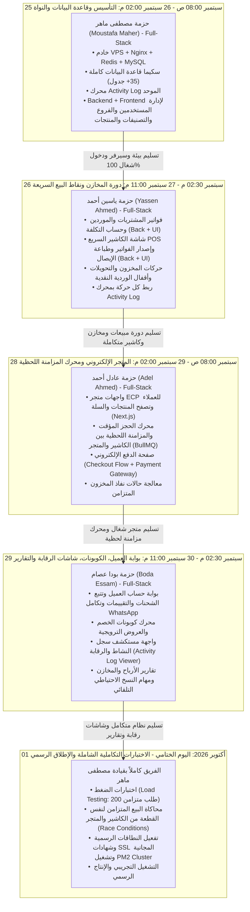

# Yoka Store — خطة المهام وجدول حزم العمل المتسلسلة (Project Tasks)
### نظام إدارة المبيعات والمخازن (SWM) والمتجر الإلكتروني (ECP)
**نموذج التطوير الشامل (Full-Stack Relay Pipeline) — من 25 سبتمبر 2026 إلى 01 أكتوبر 2026**

---

## 1. فلسفة خطة العمل وقواعد التنفيذ (Core Principles)

بناءً على التوجيهات الصارمة لإدارة المشروع، تم اعتماد الهيكلية التالية:

1. **تاريخ البداية والنهاية:**  
   يبدأ العمل رسمياً يوم **الجمعة 25-09-2026** وينتهي يوم **الخميس 01-10-2026** (7 أيام عمل مكثفة وحاسمة).
2. **الجميع Full-Stack (لا يوجد تخصص منفرد):**  
   كل عضو في الفريق مسؤول عن تسليم حزمته بشكل شامل **(قاعدة البيانات + الواجهات الخلفية Backend APIs + الواجهات الأمامية Frontend UI + تسجيل العمليات في الـ Activity Log)**.
3. **نظام حزم العمل المتسلسلة (Sequential Bulk Relay):**  
   يعمل الفريق بنظام تتابع الحزم التراكمي؛ حيث يستلم العضو حزمة عمل متكاملة ضخمة (Bulk Package)، يُنهيها بنسبة 100% ويختبرها على السيرفر، ثم يسلمها للعضو التالي ليبني الحزمة اللاحقة فوقها مباشرة دون تعارض.
4. **توزيع حزم العمل على أعضاء الفريق الـ 4:**
   - **الحزمة 1 (Bulk 1):** مصطفى ماهر (Moustafa Maher) ── [25 سبتمبر (08:00 ص) إلى 26 سبتمبر (02:00 م)] — 1.5 يوم
   - **الحزمة 2 (Bulk 2):** ياسين أحمد (Yassen Ahmed) ────── [26 سبتمبر (02:30 م) إلى 27 سبتمبر (11:00 م)] — 1.5 يوم
   - **الحزمة 3 (Bulk 3):** عادل أحمد (Adel Ahmed) ──────── [28 سبتمبر (08:00 ص) إلى 29 سبتمبر (02:00 م)] — 1.5 يوم
   - **الحزمة 4 (Bulk 4):** بودا عصام (Boda Essam) ───────── [29 سبتمبر (02:30 م) إلى 30 سبتمبر (11:00 م)] — 1.5 يوم
   - **يوم الإطلاق المشترك (Launch Day):** الفريق كاملاً ─── [01 أكتوبر 2026 (طوال اليوم)]

---

## 2. المخطط التدفقي لتتابع حزم العمل (Bulk Relay Workflow)

---

## 3. التفصيل الدقيق لحزم العمل والمخرجات (Detailed Bulk Packages)

---

### حزمة العمل 1 (Bulk 1): التأسيس، قاعدة البيانات، المصادقة، والبيانات الأساسية
- **المسؤول الشامل (Full-Stack):** مصطفى ماهر (Moustafa Maher)
- **الفترة الزمنية:** من 25-09-2026 (08:00 ص) إلى 26-09-2026 (02:00 م)
- **المدة:** 1.5 يوم عمل (30 ساعة عمل مكثفة)
- **حالة الاعتمادية:** نقطة الانطلاق الرسمية للمشروع (تفتح العمل للحزمة 2).

#### المهام المشمولة داخل الحزمة (Scope of Work):
1. **البنية التحتية والخادم (DevOps):**
   - تثبيت وإعداد خادم Hostinger VPS (Ubuntu 24.04).
   - إعداد MySQL 8.0 مع ضبط الفهارس والذاكرة (`innodb_buffer_pool_size = 4G`).
   - إعداد خادم Redis 7.2 وتأمينه، وإعداد Node.js 20 و PM2 و Nginx Web Server.
2. **قاعدة البيانات (Database Schema):**
   - تشغيل ملفات الـ Migrations لكافة الجداول الـ 35+ المذكورة في الخطة الفنية:
     `branches`, `users`, `categories`, `brands`, `products`, `product_variants`, `inventory_balances`, `inventory_movements`, `suppliers`, `purchase_invoices`, `swm_sales_invoices`, `cash_registers`, `ecp_customers`, `ecp_orders`, `sync_events`, `activity_logs`, إلخ.
   - تشغيل الـ Seeders لإدخال بيانات الفروع، والمدراء، والبيانات الأولية.
3. **النواة البرمجية المشتركة (Shared Core):**
   - بناء مكتبة الاتصال المشتركة بقاعدة البيانات والـ Redis (`shared/db.js`, `shared/redis.js`).
   - بناء وتفعيل محرك مراقبة وتسجيل العمليات الموحد `logActivity(req, actionData)` لتخزين التفاصيل تلقائياً داخل جدول `activity_logs`.
   - وسيط التحقق من الهوية والصلاحيات JWT & RBAC.
4. **الواجهات الخلفية والأمامية للبيانات الأساسية (Full-Stack Feature):**
   - بناء مسارات REST APIs لإدارة المستخدمين، الفروع، التصنيفات، المنتجات والمقاسات والألوان.
   - بناء واجهات الويب (Frontend UI) لشاشات تسجيل الدخول، إدارة المستخدمين والصلاحيات، وإدارة قائمة المنتجات والأسعار والمخزون الافتتاحي.
- **شرط التسليم والانتقال للحزمة التالية (Definition of Done & Hand-off):**
  - السيرفر يعمل وقاعدة البيانات خالية من أي أخطاء، والمستخدم يستطيع تسجيل الدخول وإضافة وتعديل المنتجات والفروع من شاشات الويب، وكل عملية يتم توثيقها تلقائياً داخل جدول `activity_logs`.
  - عقد جلسة تسليم مباشرة (Hand-off Meeting) في تمام 02:00 م يوم 26-09-2026 لتسليم المستودع والبيئة لياسين أحمد.

---

### حزمة العمل 2 (Bulk 2): دورة المشتريات، المخازن، ونقاط البيع السريعة (SWM POS)
- **المسؤول الشامل (Full-Stack):** ياسين أحمد (Yassen Ahmed)
- **الفترة الزمنية:** من 26-09-2026 (02:30 م) إلى 27-09-2026 (11:00 م)
- **المدة:** 1.5 يوم عمل (32 ساعة عمل)
- **الاعتمادية:** تعتمد اعتماداً كلياً على اكتمال الحزمة 1 واستلام قاعدة البيانات وواجهات المنتجات من مصطفى ماهر.

#### المهام المشمولة داخل الحزمة (Scope of Work):
1. **دورة المشتريات والموردين (Backend + Frontend):**
   - بناء مسارات وشاشات إدارة الموردين، وإدخال فواتير المشتريات وتوزيع البضاعة على الفروع.
   - تحديث أرصدة المخازن تلقائياً وإعادة حساب المتوسط المرجح لتكلفة الصنف.
2. **نظام نقطة البيع السريعة للكاشير (POS Fast Terminal):**
   - بناء واجهة الكاشير التفاعلية (React UI): البحث السريع، قارئ الباركود، واختيار المقاس/اللون بضغطة زر واحدة.
   - معالجة الفاتورة في الـ Backend عبر `DB Transaction` لحسم الكميات ومنع التعارضات الحسابية.
   - حساب الخصومات وضريبة القيمة المضافة، وطرق السداد (نقدي / فيزا / آجل).
   - تصميم وتفعيل طباعة الإيصال الحراري فورياً (Thermal Receipt 80mm).
3. **جلسات الخزينة وحركات النقدية والمخزون:**
   - شاشات ومسارات فتح وإغلاق ورديات الكاشير، إدخال مبالغ العهدة، والمطابقة النقدية.
   - مسارات وشاشات التحويل المخزني بين الفروع وإثبات الاستلام.
4. **تكامل سجل العمليات (Activity Log):**
   - ربط كل حركة بيع، شراء، تعديل رصيد، أو فتح/إغلاق وردية بدالة `logActivity`.
- **شرط التسليم والانتقال للحزمة التالية (Definition of Done & Hand-off):**
  - الكاشير يستطيع تنفيذ عملية بيع كاملة في الفرع وطباعة الفاتورة في أقل من 5 ثوانٍ، وجرد الخزينة مطابق، والمخزون ينخفض بشكل صحيح في قاعدة البيانات.
  - تسليم الفرع البرمجي المعتمد لـ عادل أحمد في تمام 11:00 م يوم 27-09-2026.

---

### حزمة العمل 3 (Bulk 3): المتجر الإلكتروني، محرك المزامنة اللحظية، وإتمام الشراء
- **المسؤول الشامل (Full-Stack):** عادل أحمد (Adel Ahmed)
- **الفترة الزمنية:** من 28-09-2026 (08:00 ص) إلى 29-09-2026 (02:00 م)
- **المدة:** 1.5 يوم عمل (30 ساعة عمل)
- **الاعتمادية:** تعتمد على اكتمال الحزمة 1 و 2 (المخزون والمنتجات وحركات الكاشير جاهزة).

#### المهام المشمولة داخل الحزمة (Scope of Work):
1. **واجهات وخدمات متجر العملاء (Next.js Storefront - Back & Front):**
   - بناء واجهة المتجر الرئيسية للجمهور، الكتالوج، وتصفية المنتجات حسب الفئة والمقاس والسعر.
   - صفحة المنتج التفاعلية (معاينة الصور، اختيار المتغيرات المتاحة فعلياً فقط في المخزن).
   - سلة التسوق المنبثقة (Slide Cart) وتحديث الكميات فورياً.
2. **محرك المزامنة اللحظية والاحتجاز المؤقت (Sync Engine & Locking):**
   - بناء آلية قفل المخزون المؤقت (15 دقيقة) أثناء مرحلة الدفع باستخدام Redis لمنع البيع الزائد (Overselling).
   - بناء طابور `BullMQ` لخصم المخزون الحقيقي فور تأكيد الطلب إلكترونياً.
   - مزامنة المخزون بين عمليات بيع الكاشير في الفرع والمتجر في زمن استجابة أقل من ثانيتين.
3. **مسار إتمام الطلب وبوابات الدفع (Checkout & Payment Gateway):**
   - شاشة إتمام الطلب من صفحة واحدة (One-page Checkout) وحساب تكلفة الشحن آلياً حسب المحافظة.
   - دمج بوابات الدفع (Stripe / Paymob) مع نافذة دفع آمنة + خيار الدفع عند الاستلام (COD).
   - مسار استقبال إشعارات الدفع (Webhooks) وتأكيد الطلب أوتوماتيكياً.
- **شرط التسليم والانتقال للحزمة التالية (Definition of Done & Hand-off):**
  - يستطيع أي عميل شراء منتج من المتجر والدفع بالبطاقة، ويتم حجز المخزون ومنع شرائه من الكاشير في نفس اللحظة، وتوليد رقم طلب سليم.
  - تسليم الفرع البرمجي المعتمد لـ بودا عصام في تمام 02:00 م يوم 29-09-2026.

---

### حزمة العمل 4 (Bulk 4): بوابة العميل، الكوبونات، شاشات الرقابة، التقارير والأتمتة
- **المسؤول الشامل (Full-Stack):** بودا عصام (Boda Essam)
- **الفترة الزمنية:** من 29-09-2026 (02:30 م) إلى 30-09-2026 (11:00 م)
- **المدة:** 1.5 يوم عمل (32 ساعة عمل)
- **الاعتمادية:** تعتمد على استلام دورة النظام كاملة من حزم 1 و 2 و 3.

#### المهام المشمولة داخل الحزمة (Scope of Work):
1. **بوابة العميل التفاعلية والكوبونات (Customer Portal & Coupons):**
   - مسارات وشاشات حساب العميل في المتجر (سجل الطلبات السابقة، تتبع حالة الشحنة).
   - تكامل إرسال تفاصيل الفاتورة وتأكيد الشحن عبر رابط WhatsApp مباشر.
   - نظام ومسارات كوبونات الخصم والعروض الترويجية والتحقق من صلاحيتها في الـ Checkout.
   - نظام تقييمات المنتجات المشتراة وإدارتها.
2. **شاشات استعراض سجل النشاط والرقابة (Activity Log Viewer UI):**
   - بناء شاشة لوحة تحكم الإدارة لمستكشف السجلات (`Activity Log Explorer`):
     - جدول تفاعلي يعرض كل العمليات المسجلة في النظام مرتبة زمنياً.
     - فلاتر متقدمة: حسب اسم الموظف، الفرع، نوع الإجراء (بيع، خصم، تعديل سعر، سحب نقدي).
     - نافذة مقارنة التغيير (Diff Viewer) لإظهار القيمة قبل التعديل وبعده.
3. **التقارير المالية والمخزنية المتقدمة:**
   - شاشات تقارير أرباح المبيعات، ومقارنة أداء الفروع، وتقرير حركة الأصناف الراكدة ونواقص المخزن.
   - ميزة تصدير التقارير إلى Excel و PDF بضغطة زر.
4. **المهام المؤتمتة الدورية (Cron Jobs & Automation):**
   - سكريبت النسخ الاحتياطي التلقائي لقاعدة البيانات يومياً في 03:00 ص ورفعه لتخزين سحابي آمن.
   - جدولة تفريغ السلات المتروكة وإعادة المخزون المحجوز كل 5 دقائق.
   - نظام التنبيه بالنواقص (Low Stock Alerts) عبر البريد الإلكتروني.
- **شرط التسليم والانتقال للحزمة التالية (Definition of Done & Hand-off):**
  - المدير يرى كل تحركات الموظفين في شاشة الـ Activity Log، وتقارير الأرباح تعمل، ونظام الكوبونات والنسخ الاحتياطي مفعل ومختبر.
  - تسليم كود المشروع المكتمل للفريق في تمام 11:00 م يوم 30-09-2026 استعداداً للإطلاق.

---

### اليوم الختامي (Day 7): الاختبارات الشاملة والإطلاق الرسمي للإنتاج
- **المسؤولون:** الفريق كاملاً (مصطفى ماهر، ياسين أحمد، عادل أحمد، بودا عصام)
- **القيادة:** مصطفى ماهر (Moustafa Maher)
- **التاريخ:** **01-10-2026** (طوال اليوم من 08:00 ص إلى 08:00 م)
- **الاعتمادية:** اكتمال الحزم الأربع (Bulk 1, 2, 3, 4) بنسبة 100%.

#### جدول أعمال اليوم الختامي:
1. **اختبارات محاكاة الضغط وتزامن العمليات (08:00 ص - 12:00 م):**
   - تجربة بيع آخر قطعة متوفرة في المخزن من الكاشير والمتجر الإلكتروني في نفس الثانية (Race Condition Test) والتأكد من نجاح عملية واحدة فقط دون أخطاء.
   - اختبار ضغط على الـ APIs بإرسال 200 طلب متزامن وقياس استقرار الذاكرة وسرعة الرد.
2. **معالجة الملاحظات والضبط النهائي (12:30 م - 03:30 م):**
   - سد أي ثغرات أو معالجة أي أخطاء تظهر في سجل النشاط أو الاستجابة.
   - تنظيف قاعدة البيانات من البيانات التجريبية وضبط الأرصدة الافتتاحية الحقيقية للعميل.
3. **الإطلاق على بيئة الإنتاج الحية (04:00 م - 08:00 م):**
   - تفعيل النطاقات الرسمية للدومين وتوليد شهادات SSL المشفرة عبر Let's Encrypt.
   - تشغيل النظم بوضع الإنتاج الموزع (PM2 Cluster Mode).
   - ضبط Nginx Caching وتأمين المنافذ بنسبة 100%.
   - تسليم بيانات النظام للإدارة وبدء التشغيل الفعلي.

---

## 4. الجدول الزمني التتابعي للمشروع (Timeline Master Matrix)

| التاريخ والوقت | حزمة العمل النشطة | المسؤول الرئيسي | دور باقي أعضاء الفريق خلال الفترة |
| :---: | :--- | :--- | :--- |
| **25-09-2026** (طوال اليوم) | **الحزمة 1:** إعداد السيرفر VPS + سكيما الجداول الـ 35+ ومحرك السجلات | **مصطفى ماهر** | مراجعة سكيما الجداول ومخطط الـ APIs لكل حزمة |
| **26-09-2026** (08:00 ص - 02:00 م) | **الحزمة 1:** إنهاء APIs وشاشات المستخدمين والفروع والمنتجات الأساسية | **مصطفى ماهر** | استلام الدخول للسيرفر واختبار اتصال DB ومحرك `logActivity` |
| **26-09-2026** (02:30 م - 11:00 م) | **الحزمة 2:** بناء فواتير المشتريات والموردين وحساب التكاليف (Back + Front) | **ياسين أحمد** | مصطفى: مراجعة الكود، عادل وبودا: استعراض مخرجات الحزمة |
| **27-09-2026** (طوال اليوم) | **الحزمة 2:** بناء شاشة كاشير POS السريعة، طباعة الإيصال وإغلاق الوردية | **ياسين أحمد** | تجربة عملية بيع كاشير حقيقية واعتماد تسليم الحزمة 2 |
| **28-09-2026** (طوال اليوم) | **الحزمة 3:** بناء كتالوج متجر ECP وصفحات المنتجات والسلة (Next.js) | **عادل أحمد** | ربط كتالوج المتجر مع بيانات المخزون المفرزة في حزمة 2 |
| **29-09-2026** (08:00 ص - 02:00 م) | **الحزمة 3:** بناء محرك المزامنة اللحظية BullMQ وصفحة الدفع والشحن | **عادل أحمد** | اختبار مزامنة رصيد المخزن بين المتجر والكاشير في نفس اللحظة |
| **29-09-2026** (02:30 م - 11:00 م) | **الحزمة 4:** بناء بوابة حساب العميل، الكوبونات وإرسال WhatsApp | **بودا عصام** | اختبار تجربة العميل بعد الشراء ومطابقة كود الخصم |
| **30-09-2026** (طوال اليوم) | **الحزمة 4:** بناء شاشة استعراض سجل النشاط Activity Log والتقارير والنسخ الاحتياطي | **بودا عصام** | التحقق من ظهور كافة حركات الأيام السابقة في شاشة السجلات |
| **01-10-2026** (طوال اليوم) | **يوم الإطلاق:** اختبارات الضغط الشاملة + النشر على الإنتاج وتفعيل SSL | **الفريق كاملاً** بقيادة **مصطفى** | إطلاق النظام الرسمي وتسليم المشروع بنجاح |

---

## 5. ميثاق تسليم حزم العمل (Bulk Hand-off Criteria)

قبل أن يُعلن أي مهندس انتهاء حزمته وتسليمها للعضو التالي في السلسلة، يجب توفير المخرجات التالية على الفرع المعتمد:

1. **كود Full-Stack متكامل ومختبر:** تم كتابة واختبار الـ Endpoints بالـ Backend والصفحات بالـ Frontend دون الاعتماد على بيانات وهمية (No Mock Data).
2. **سجل الرقابة ملزم:** كل Endpoint لتعديل أو إضافة أو حذف بيانات يستدعي دالة `logActivity` الإلزامية ويسجل القيمة قبل وبعد التعديل.
3. **معاملات آمنة (ACID Transactions):** أي عمليات تمس المخزن أو الأموال تستخدم `db.beginTransaction()` وتضمن عدم حدوث كسور أو أرقام سالبة.
4. **جلسة تسليم حية (Hand-off Walkthrough):** يعقد المهندس المسلم اجتماعاً سريعاً (15 دقيقة) مع المهندس التالي لشرح نقاط الربط واختبار مسار العمل المشترك.

---
*تم تحديث تاريخ بداية الخطة ليبدأ رسمياً من 25-09-2026 وينتهي في 01-10-2026 بنظام حزم العمل المتسلسلة (Full-Stack Relay).*
