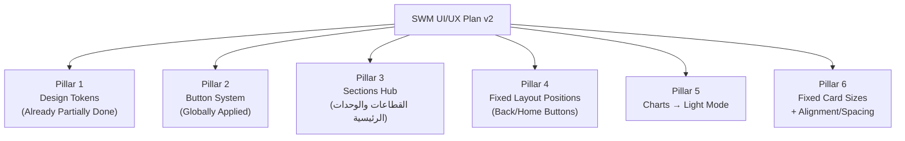
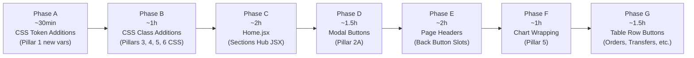

# SWM Platform — UI & UX Improvements Plan (v2)
> **Stack:** React + Ant Design v5 (RTL, Cairo font) | **Color System:** Indigo Admin + Operational Role Streams | **Mode:** Light-Only  
> **Scope:** `client-swm` only — Zero navigation flow or routing changes  
> **Based on:** Existing `swm_ui_improvement_plan.md` + UI/UX Pro Max Skill + Deep codebase audit (Oct 2026)

---

> [!IMPORTANT]
> **Absolute Constraints (Never Violate)**
> 1. No routing or navigation flow changes — `onNavigate()` calls stay exactly as-is.
> 2. The E-Commerce sections (`أقسام المتجر الإلكتروني`) are **excluded from all improvements**.
> 3. No form logic, API calls, state management, or business logic changes.
> 4. Every change is **additive** (new CSS classes, new JSX props) — never a rewrite.
> 5. Back button / home button **navigation behavior** is frozen — only its **visual presentation and consistent layout position** changes.

---

## 🗺️ What This Plan Covers (6 Implementation Pillars)



---

## Current State Audit (What We Found in the Code)

### ✅ Already Done (from previous plan — Phase 1 & 2 are live)
| Item | Status | Location |
|------|--------|----------|
| CSS Design Tokens (`:root` block) | ✅ Live | `index.css` lines 1–66 |
| `.swm-btn-*` button system | ✅ Live | `index.css` lines 958–1072 |
| `.swm-toolbar` utility | ✅ Live | `index.css` lines 1100–1131 |
| `.section-widget-header` with stream colors | ✅ Live | `index.css` lines 1204–1216 |
| `.stat-metric-card` KPI typography | ✅ Live | `index.css` lines 1133–1159 |
| Micro-animation layer | ✅ Live | `index.css` lines 1161–1202 |
| Sidebar + Topbar polish | ✅ Live | `index.css` lines 1218–1241 |
| `quick-action-card` hover arrow | ✅ Live | `index.css` lines 1087–1091 |

### ❌ Not Yet Done (This Plan Targets These)
| Item | Priority | Effort |
|------|----------|--------|
| "القطاعات والوحدات الرئيسية" — unified navigation section | P1 | ~4h |
| Fixed position for Back/Home buttons across all pages | P1 | ~2h |
| Main function buttons — visible, prominent, consistent sizing | P2 | ~3h |
| Charts forced to light mode | P2 | ~1h |
| Fixed card sizes with alignment/spacing grid | P2 | ~2h |
| Modal submit buttons — full-width, large, loading wired | P3 | ~1.5h |

---

## Pillar 1 — Design Token Additions (New Variables Needed)

**File:** [`index.css`](file:///E:/WORK/FreeLance/Yoka%20Store/client-swm/src/index.css)  
**Append to the `:root` block (lines 1–66)**

```css
:root {
  /* === (Existing tokens remain — add these new ones below the existing block) === */

  /* === Sections Hub Navigation === */
  --color-inventory:        #1D4ED8;   /* أقسام المخزون — Royal Blue */
  --color-inventory-s:      #EFF6FF;
  --color-inventory-b:      #BFDBFE;
  --color-purchases:        #065F46;   /* أقسام المشتريات — Deep Emerald */
  --color-purchases-s:      #F0FDF4;
  --color-purchases-b:      #A7F3D0;
  --color-finance:          #92400E;   /* أقسام المالية — Amber */
  --color-finance-s:        #FFFBEB;
  --color-finance-b:        #FDE68A;
  --color-analytics:        #5B21B6;   /* أقسام التحليلات — Violet */
  --color-analytics-s:      #F5F3FF;
  --color-analytics-b:      #DDD6FE;
  --color-system:           #0F766E;   /* أقسام إدارة النظام — Teal */
  --color-system-s:         #F0FDFA;
  --color-system-b:         #99F6E4;

  /* === Fixed Card Dimensions (layout grid) === */
  --card-nav-h:             290px;    /* unified navigation hub card height */
  --card-stat-h:            88px;     /* KPI stat strip card height */
  --card-quick-h:           164px;    /* quick action card height (existing) */
  --card-pos-h:             300px;    /* POS hero nav card height (existing) */

  /* === Z-index Scale === */
  --z-toolbar:              10;
  --z-back-btn:             20;
  --z-modal:                1000;

  /* === Back Button Fixed Position === */
  --back-btn-top:           16px;
  --back-btn-inset-end:     0px;      /* RTL: right edge = 0, relative to page wrapper */
}
```

---

## Pillar 2 — Button System: Apply `.swm-btn-*` Classes to All Pages

> [!NOTE]
> The `.swm-btn-*` CSS system exists. This pillar specifies **exactly where and how** to apply the existing classes in each page file.

### 2A. Button Role Taxonomy (The "Never Repeat" Rule)

Each form or page section should have **at most one primary action button**. Use this hierarchy:

| Button Role | Class | Size | Color | Rule |
|-------------|-------|------|-------|------|
| Primary Submit (save/create) | `swm-btn swm-btn-primary` or Ant `type="primary" size="large"` | `lg` (48px) | Indigo `#4F46E5` | 1 per form/modal |
| Operational Primary (sale, disburse) | `swm-btn swm-btn-sale` / `swm-btn-expense` | `lg` (48px) | Stream color | 1 per action zone |
| Secondary Navigate (cancel/back) | `swm-btn swm-btn-ghost` | `md` (40px) | Ghost | Paired with primary |
| Table Row Action | Ant `size="middle"` + `ghost` | `middle` (36px min) | Semantic | Max 3 per row |
| Inline Utility (generate/toggle) | Ant `type="link"` | `small` | Indigo link | No limits |
| Destructive | `swm-btn swm-btn-danger` | `md` | Red | Only in Popconfirm |

### 2B. Per-Page Button Upgrade Specs

#### `Home.jsx` — Modal Submit Buttons
All 5 modal footers use a similar pattern. Current state: `type="primary" size="default"` (32px).  
**Required change:** add `size="large"` and `block` prop to the submit button.

```jsx
// BEFORE (lines 1975, 2070, 2167, 2239, 2324 — same pattern in all 5 modals):
<Button type="primary" htmlType="submit" loading={submitting} style={{ backgroundColor: '#4f46e5' }}>
  حفظ المنتج وتثبيته
</Button>

// AFTER — add size="large" and block:
<Button
  type="primary"
  htmlType="submit"
  loading={submitting}
  size="large"
  block
  style={{ height: 48, fontWeight: 700, borderRadius: 10 }}
>
  {submitting ? 'جاري الحفظ...' : 'حفظ المنتج وتثبيته'}
</Button>
```

Apply this to all 5 modal footers:
- Line ~1975: Product modal → `backgroundColor: '#4f46e5'`  
- Line ~2070: Branch modal → `backgroundColor: '#059669'`  
- Line ~2167: User modal → `backgroundColor: '#2563eb'`  
- Line ~2239: Supplier modal → `backgroundColor: '#d97706'`  
- Line ~2324: Expense modal → `backgroundColor: '#db2777'`

Also upgrade the Cancel buttons to `size="large"` for equal pairing:
```jsx
<Button onClick={() => setProductModalOpen(false)} size="large" style={{ height: 48 }}>إلغاء</Button>
```

#### `Purchases.jsx` — Bottom Form Action Button
The file is 253KB — target only the main submit/save button at the bottom of each form section. Change from `size="middle"` to `size="large"` and add `block` + `loading` wiring where missing.

#### `Orders.jsx` — Table Row Action Buttons
Current: `size="small"` → 28px height.  
Required: `size="middle"` → 36px min + wrap in `<Tooltip>`.

```jsx
// Pattern to apply across Orders.jsx table columns actions:
<Space size={6}>
  <Tooltip title="عرض تفاصيل الطلب">
    <Button size="middle" type="primary" ghost icon={<EyeOutlined />} onClick={...} />
  </Tooltip>
  <Tooltip title="إلغاء الطلب">
    <Button size="middle" danger ghost icon={<CloseCircleOutlined />} onClick={...} />
  </Tooltip>
</Space>
```

#### `Transfers.jsx`, `StockAdjustments.jsx`, `StockAudit.jsx`
Same pattern — upgrade table row action buttons from `size="small"` → `size="middle"` + `<Tooltip>`.

#### `TreasuryAdmin.jsx`, `AdminJournals.jsx`
The payroll disburse button at line ~1099–1112 in Home.jsx is already `size="middle"`. Upgrade to `size="large"`.

---

## Pillar 3 — "القطاعات والوحدات الرئيسية" Unified Sections Hub

> [!IMPORTANT]
> This is the **most impactful single change** in this plan. The Home page currently uses scattered `quick-action-card` grids to navigate to system sections. We need a **dedicated, visually distinct, consistent navigation hub section** that presents all major non-E-Commerce system modules in a clear, scannable layout using the `unified-nav-card` / `unified-dashboard-grid` CSS classes that already exist in `index.css` (lines 884–952).

### 3A. Section Structure Design

The "القطاعات والوحدات الرئيسية" section should appear **after the KPI strip** and **before the Quick Action cards** (or as a standalone dedicated block). It must contain 5 domain groups (E-Commerce is excluded):

```
أقسام إدارة المخزون والأصناف     → 3 entry points → opens existing pages
أقسام المشتريات والتوريد         → 2 entry points → opens existing pages
أقسام المالية والخزائن            → 2 entry points → opens existing pages
أقسام التحليلات والتقارير الرقابية → 3 entry points → opens existing pages
أقسام إدارة النظام والفروع        → 2 entry points → opens existing pages
```

### 3B. CSS Classes to Add (Additive Only)

Add this block to the end of `index.css`:

```css
/* ================================================= */
/* SECTIONS HUB — القطاعات والوحدات الرئيسية       */
/* ================================================= */

/* Hub section title strip */
.swm-hub-section-title {
  display: flex;
  align-items: center;
  gap: 10px;
  margin-bottom: 20px;
  padding-bottom: 12px;
  border-bottom: 2px solid var(--slate-200);
}

.swm-hub-section-title .hub-title-accent {
  width: 4px;
  height: 24px;
  border-radius: 2px;
  flex-shrink: 0;
}

.swm-hub-section-title h3 {
  font-size: 18px;
  font-weight: 800;
  color: var(--navy);
  margin: 0;
}

/* Domain group card container */
.swm-domain-group {
  background: var(--card-bg);
  border: 1.5px solid var(--slate-200);
  border-radius: var(--radius-lg);
  padding: 20px 24px;
  margin-bottom: 16px;
  transition: var(--transition-base);
  position: relative;
  overflow: hidden;
}

/* Left accent stripe (RTL = border-right) */
.swm-domain-group::before {
  content: '';
  position: absolute;
  top: 0;
  right: 0;
  width: 4px;
  height: 100%;
  border-radius: 0 var(--radius-lg) var(--radius-lg) 0;
}

.swm-domain-group.domain-inventory::before  { background: var(--color-inventory); }
.swm-domain-group.domain-purchases::before  { background: var(--color-purchases); }
.swm-domain-group.domain-finance::before    { background: var(--color-finance); }
.swm-domain-group.domain-analytics::before  { background: var(--color-analytics); }
.swm-domain-group.domain-system::before     { background: var(--color-system); }

/* Domain group header */
.swm-domain-header {
  display: flex;
  align-items: center;
  gap: 12px;
  margin-bottom: 16px;
  flex-wrap: wrap;
}

.swm-domain-icon {
  width: 44px;
  height: 44px;
  border-radius: var(--radius-md);
  display: flex;
  align-items: center;
  justify-content: center;
  flex-shrink: 0;
}

.swm-domain-info h4 {
  font-size: 15px;
  font-weight: 800;
  color: var(--navy);
  margin: 0 0 2px;
}

.swm-domain-info p {
  font-size: 12px;
  color: var(--slate-500);
  margin: 0;
  line-height: 1.4;
}

/* Entry point buttons grid */
.swm-entries-grid {
  display: grid;
  grid-template-columns: repeat(auto-fit, minmax(200px, 1fr));
  gap: 10px;
}

/* Each entry button card */
.swm-entry-btn {
  display: flex;
  align-items: center;
  gap: 10px;
  padding: 12px 14px;
  border-radius: var(--radius-sm);
  border: 1.5px solid var(--slate-200);
  background: var(--slate-50);
  cursor: pointer;
  transition: var(--transition-base);
  text-decoration: none;
  user-select: none;
  outline: none;
  min-height: 56px;
}

.swm-entry-btn:hover {
  border-color: var(--slate-400);
  background: var(--slate-100);
  transform: translateY(-2px);
  box-shadow: 0 4px 10px rgba(0,0,0,0.06);
}

.swm-entry-btn:active {
  transform: translateY(0) scale(0.98);
}

.swm-entry-btn:focus-visible {
  outline: 2px solid var(--color-admin-primary);
  outline-offset: 2px;
}

/* Domain-colored entry button variant */
.swm-domain-group.domain-inventory .swm-entry-btn:hover  { border-color: var(--color-inventory); background: var(--color-inventory-s); }
.swm-domain-group.domain-purchases .swm-entry-btn:hover  { border-color: var(--color-purchases); background: var(--color-purchases-s); }
.swm-domain-group.domain-finance   .swm-entry-btn:hover  { border-color: var(--color-finance);   background: var(--color-finance-s); }
.swm-domain-group.domain-analytics .swm-entry-btn:hover  { border-color: var(--color-analytics); background: var(--color-analytics-s); }
.swm-domain-group.domain-system    .swm-entry-btn:hover  { border-color: var(--color-system);    background: var(--color-system-s); }

.swm-entry-icon-wrap {
  width: 32px;
  height: 32px;
  border-radius: 8px;
  display: flex;
  align-items: center;
  justify-content: center;
  flex-shrink: 0;
}

.swm-entry-text {
  flex: 1;
}

.swm-entry-text strong {
  display: block;
  font-size: 13px;
  font-weight: 700;
  color: var(--navy);
  line-height: 1.3;
}

.swm-entry-text span {
  display: block;
  font-size: 11px;
  color: var(--slate-500);
  line-height: 1.3;
  margin-top: 1px;
}

.swm-entry-arrow {
  color: var(--slate-400);
  transition: transform 0.2s ease;
  flex-shrink: 0;
}

.swm-entry-btn:hover .swm-entry-arrow {
  transform: translateX(-4px); /* RTL: slides inward */
  color: var(--color-admin-primary);
}

/* "فتح الصفحة" badge on entry button */
.swm-entry-badge {
  display: inline-flex;
  align-items: center;
  gap: 4px;
  font-size: 10px;
  font-weight: 700;
  padding: 2px 7px;
  border-radius: 10px;
  background: var(--slate-100);
  color: var(--slate-500);
  border: 1px solid var(--slate-200);
  white-space: nowrap;
}

/* Responsive grid collapse */
@media (max-width: 900px) {
  .swm-entries-grid {
    grid-template-columns: repeat(2, 1fr);
  }
  .swm-domain-group {
    padding: 16px 16px;
  }
}

@media (max-width: 640px) {
  .swm-entries-grid {
    grid-template-columns: 1fr;
    gap: 8px;
  }
  .swm-domain-group {
    padding: 14px 12px;
    margin-bottom: 12px;
  }
  .swm-domain-info h4 {
    font-size: 14px;
  }
}
```

### 3C. JSX Implementation Pattern (Home.jsx)

Add the following JSX block inside `Home.jsx` **after the KPI Stats Strip** (after line ~1413, before Group 1 Quick Actions). This is a **new section addition**, not a replacement:

```jsx
{/* ========================================================= */}
{/* "القطاعات والوحدات الرئيسية" — System Navigation Hub     */}
{/* ========================================================= */}
<div style={{ marginBottom: 32 }}>
  {/* Hub Section Title */}
  <div className="swm-hub-section-title">
    <div className="hub-title-accent" style={{ background: '#4F46E5' }} />
    <div>
      <h3 style={{ fontSize: 18, fontWeight: 800, color: '#0f172a', margin: 0 }}>
        القطاعات والوحدات الرئيسية
      </h3>
      <Text type="secondary" style={{ fontSize: 12 }}>
        جميع أقسام النظام — اختر القسم للانتقال مباشرة إلى الصفحة
      </Text>
    </div>
  </div>

  {/* ── Domain 1: أقسام إدارة المخزون والأصناف ── */}
  <div className="swm-domain-group domain-inventory">
    <div className="swm-domain-header">
      <div className="swm-domain-icon" style={{ background: '#EFF6FF', color: '#1D4ED8' }}>
        <Boxes size={22} />
      </div>
      <div className="swm-domain-info">
        <h4>أقسام إدارة المخزون والأصناف</h4>
        <p>التصنيفات • الجرد والتسوية • التحويلات • أذونات الصرف والتحويل</p>
      </div>
    </div>
    <div className="swm-entries-grid">

      {/* Entry: المجموعات والأصناف */}
      <div
        role="button" tabIndex={0}
        className="swm-entry-btn"
        onClick={() => onNavigate('groups_items')}
        onKeyDown={(e) => { if (e.key === 'Enter' || e.key === ' ') onNavigate('groups_items'); }}
        aria-label="فتح صفحة المجموعات والأصناف"
      >
        <div className="swm-entry-icon-wrap" style={{ background: '#EFF6FF', color: '#1D4ED8' }}>
          <Layers size={16} />
        </div>
        <div className="swm-entry-text">
          <strong>المجموعات والأصناف</strong>
          <span>شجرة التصنيفات، المقاسات، الألوان، ومواصفات الأصناف</span>
        </div>
        <ArrowRight size={14} className="swm-entry-arrow" style={{ transform: 'rotate(180deg)' }} />
      </div>

      {/* Entry: الجرد الفعلي وسندات التسوية */}
      <div
        role="button" tabIndex={0}
        className="swm-entry-btn"
        onClick={() => onNavigate('stock_adjustments')}
        onKeyDown={(e) => { if (e.key === 'Enter' || e.key === ' ') onNavigate('stock_adjustments'); }}
        aria-label="فتح صفحة الجرد الفعلي وسندات التسوية"
      >
        <div className="swm-entry-icon-wrap" style={{ background: '#EFF6FF', color: '#1D4ED8' }}>
          <ClipboardCheck size={16} />
        </div>
        <div className="swm-entry-text">
          <strong>الجرد الفعلي وسندات التسوية</strong>
          <span>الجرد الميداني، معالجة العجز والزيادة، اعتماد سندات التسوية</span>
        </div>
        <ArrowRight size={14} className="swm-entry-arrow" style={{ transform: 'rotate(180deg)' }} />
      </div>

      {/* Entry: التحويلات بين الفروع والمستودعات */}
      <div
        role="button" tabIndex={0}
        className="swm-entry-btn"
        onClick={() => onNavigate('transfers')}
        onKeyDown={(e) => { if (e.key === 'Enter' || e.key === ' ') onNavigate('transfers'); }}
        aria-label="فتح صفحة التحويلات وأذونات الصرف"
      >
        <div className="swm-entry-icon-wrap" style={{ background: '#EFF6FF', color: '#1D4ED8' }}>
          <ArrowLeftRight size={16} />
        </div>
        <div className="swm-entry-text">
          <strong>التحويل بين الفروع والمستودعات</strong>
          <span>أذونات الصرف والتحويل، سندات استلام البضائع</span>
        </div>
        <ArrowRight size={14} className="swm-entry-arrow" style={{ transform: 'rotate(180deg)' }} />
      </div>

    </div>
  </div>

  {/* ── Domain 2: أقسام المشتريات والتوريد ── */}
  <div className="swm-domain-group domain-purchases">
    <div className="swm-domain-header">
      <div className="swm-domain-icon" style={{ background: '#F0FDF4', color: '#065F46' }}>
        <Receipt size={22} />
      </div>
      <div className="swm-domain-info">
        <h4>أقسام المشتريات والتوريد</h4>
        <p>الفواتير • الموردين • فواتير الشراء والدفعات</p>
      </div>
    </div>
    <div className="swm-entries-grid">

      {/* Entry: فواتير المشتريات والتوريد */}
      <div
        role="button" tabIndex={0}
        className="swm-entry-btn"
        onClick={() => onNavigate('purchases')}
        onKeyDown={(e) => { if (e.key === 'Enter' || e.key === ' ') onNavigate('purchases'); }}
        aria-label="فتح صفحة فواتير المشتريات والتوريد"
      >
        <div className="swm-entry-icon-wrap" style={{ background: '#F0FDF4', color: '#065F46' }}>
          <Receipt size={16} />
        </div>
        <div className="swm-entry-text">
          <strong>فواتير المشتريات والتوريد</strong>
          <span>تسجيل ومراجعة فواتير الشراء، تكلفة الوحدة، ودفعات الموردين</span>
        </div>
        <ArrowRight size={14} className="swm-entry-arrow" style={{ transform: 'rotate(180deg)' }} />
      </div>

      {/* Entry: الموردين والحسابات */}
      <div
        role="button" tabIndex={0}
        className="swm-entry-btn"
        onClick={() => onNavigate('suppliers')}
        onKeyDown={(e) => { if (e.key === 'Enter' || e.key === ' ') onNavigate('suppliers'); }}
        aria-label="فتح صفحة الموردين والحسابات"
      >
        <div className="swm-entry-icon-wrap" style={{ background: '#F0FDF4', color: '#065F46' }}>
          <Truck size={16} />
        </div>
        <div className="swm-entry-text">
          <strong>الموردين والحسابات</strong>
          <span>دليل الموردين، كشوف الحسابات التفصيلية، والأرصدة الدائنة</span>
        </div>
        <ArrowRight size={14} className="swm-entry-arrow" style={{ transform: 'rotate(180deg)' }} />
      </div>

    </div>
  </div>

  {/* ── Domain 3: أقسام المالية والخزائن ── */}
  <div className="swm-domain-group domain-finance">
    <div className="swm-domain-header">
      <div className="swm-domain-icon" style={{ background: '#FFFBEB', color: '#92400E' }}>
        <Landmark size={22} />
      </div>
      <div className="swm-domain-info">
        <h4>أقسام المالية والخزائن</h4>
        <p>الخزينة المركزية • الرواتب • التحويلات البنكية • المصروفات</p>
      </div>
    </div>
    <div className="swm-entries-grid">

      {/* Entry: الخزينة المركزية والتحويلات */}
      <div
        role="button" tabIndex={0}
        className="swm-entry-btn"
        onClick={() => onNavigate('treasury_admin')}
        onKeyDown={(e) => { if (e.key === 'Enter' || e.key === ' ') onNavigate('treasury_admin'); }}
        aria-label="فتح صفحة الخزينة المركزية والتحويلات"
      >
        <div className="swm-entry-icon-wrap" style={{ background: '#FFFBEB', color: '#92400E' }}>
          <Landmark size={16} />
        </div>
        <div className="swm-entry-text">
          <strong>الخزينة المركزية والتحويلات</strong>
          <span>حركة السيولة المركزية، التحويلات البنكية، وتصفير الخزائن</span>
        </div>
        <ArrowRight size={14} className="swm-entry-arrow" style={{ transform: 'rotate(180deg)' }} />
      </div>

      {/* Entry: مسير الرواتب */}
      <div
        role="button" tabIndex={0}
        className="swm-entry-btn"
        onClick={() => onNavigate('admin_journals')}
        onKeyDown={(e) => { if (e.key === 'Enter' || e.key === ' ') onNavigate('admin_journals'); }}
        aria-label="فتح صفحة مسير الرواتب واليوميات"
      >
        <div className="swm-entry-icon-wrap" style={{ background: '#FFFBEB', color: '#92400E' }}>
          <Users size={16} />
        </div>
        <div className="swm-entry-text">
          <strong>مسير الرواتب وبنود المصروفات</strong>
          <span>تسوية مرتبات البائعين، السلف، الخصومات، وإدارة مصروفات الفروع</span>
        </div>
        <ArrowRight size={14} className="swm-entry-arrow" style={{ transform: 'rotate(180deg)' }} />
      </div>

    </div>
  </div>

  {/* ── Domain 4: أقسام التحليلات والتقارير الرقابية ── */}
  <div className="swm-domain-group domain-analytics">
    <div className="swm-domain-header">
      <div className="swm-domain-icon" style={{ background: '#F5F3FF', color: '#5B21B6' }}>
        <BarChart3 size={22} />
      </div>
      <div className="swm-domain-info">
        <h4>أقسام التحليلات والتقارير الرقابية</h4>
        <p>المبيعات • اليومية • اليوميات الإدارية • الرسوم البيانية</p>
      </div>
    </div>
    <div className="swm-entries-grid">

      {/* Entry: تحليلات المبيعات والإيرادات */}
      <div
        role="button" tabIndex={0}
        className="swm-entry-btn"
        onClick={() => onNavigate('retail_analytics')}
        onKeyDown={(e) => { if (e.key === 'Enter' || e.key === ' ') onNavigate('retail_analytics'); }}
        aria-label="فتح صفحة تحليلات المبيعات والإيرادات"
      >
        <div className="swm-entry-icon-wrap" style={{ background: '#F5F3FF', color: '#5B21B6' }}>
          <TrendingUp size={16} />
        </div>
        <div className="swm-entry-text">
          <strong>تحليلات المبيعات والإيرادات المركزية</strong>
          <span>رسوم بيانية، مقارنة الفروع، تقييم البائعين، سجل المرتجعات</span>
        </div>
        <ArrowRight size={14} className="swm-entry-arrow" style={{ transform: 'rotate(180deg)' }} />
      </div>

      {/* Entry: يومية الفروع المجمعة */}
      <div
        role="button" tabIndex={0}
        className="swm-entry-btn"
        onClick={() => onNavigate('branches_daily')}
        onKeyDown={(e) => { if (e.key === 'Enter' || e.key === ' ') onNavigate('branches_daily'); }}
        aria-label="فتح صفحة يومية الفروع المجمعة"
      >
        <div className="swm-entry-icon-wrap" style={{ background: '#F5F3FF', color: '#5B21B6' }}>
          <CalendarCheck size={16} />
        </div>
        <div className="swm-entry-text">
          <strong>يومية الفروع المجمعة</strong>
          <span>كشف الحساب اليومي الشامل لمبيعات ومصروفات ونقدية كل فرع</span>
        </div>
        <ArrowRight size={14} className="swm-entry-arrow" style={{ transform: 'rotate(180deg)' }} />
      </div>

      {/* Entry: اليوميات الإدارية والرقابة */}
      <div
        role="button" tabIndex={0}
        className="swm-entry-btn"
        onClick={() => onNavigate('admin_journals')}
        onKeyDown={(e) => { if (e.key === 'Enter' || e.key === ' ') onNavigate('admin_journals'); }}
        aria-label="فتح صفحة اليوميات الإدارية والرقابة"
      >
        <div className="swm-entry-icon-wrap" style={{ background: '#F5F3FF', color: '#5B21B6' }}>
          <BookOpenCheck size={16} />
        </div>
        <div className="swm-entry-text">
          <strong>اليوميات الإدارية والرقابة</strong>
          <span>سجلات التدقيق الإداري، دفتر المصروفات، والعمليات المخزنية</span>
        </div>
        <ArrowRight size={14} className="swm-entry-arrow" style={{ transform: 'rotate(180deg)' }} />
      </div>

    </div>
  </div>

  {/* ── Domain 5: أقسام إدارة النظام والفروع ── */}
  <div className="swm-domain-group domain-system">
    <div className="swm-domain-header">
      <div className="swm-domain-icon" style={{ background: '#F0FDFA', color: '#0F766E' }}>
        <Building2 size={22} />
      </div>
      <div className="swm-domain-info">
        <h4>أقسام إدارة النظام والفروع</h4>
        <p>الفروع • المستودعات • المستخدمين • الصلاحيات</p>
      </div>
    </div>
    <div className="swm-entries-grid">

      {/* Entry: الفروع والمستودعات */}
      <div
        role="button" tabIndex={0}
        className="swm-entry-btn"
        onClick={() => onNavigate('branches')}
        onKeyDown={(e) => { if (e.key === 'Enter' || e.key === ' ') onNavigate('branches'); }}
        aria-label="فتح صفحة الفروع والمستودعات"
      >
        <div className="swm-entry-icon-wrap" style={{ background: '#F0FDFA', color: '#0F766E' }}>
          <Store size={16} />
        </div>
        <div className="swm-entry-text">
          <strong>الفروع والمستودعات</strong>
          <span>إدارة الفروع، نقاط البيع، والمستودعات وتعيين الصلاحيات</span>
        </div>
        <ArrowRight size={14} className="swm-entry-arrow" style={{ transform: 'rotate(180deg)' }} />
      </div>

      {/* Entry: المستخدمين والصلاحيات */}
      <div
        role="button" tabIndex={0}
        className="swm-entry-btn"
        onClick={() => onNavigate('users')}
        onKeyDown={(e) => { if (e.key === 'Enter' || e.key === ' ') onNavigate('users'); }}
        aria-label="فتح صفحة المستخدمين والصلاحيات"
      >
        <div className="swm-entry-icon-wrap" style={{ background: '#F0FDFA', color: '#0F766E' }}>
          <ShieldCheck size={16} />
        </div>
        <div className="swm-entry-text">
          <strong>المستخدمين والصلاحيات</strong>
          <span>إدارة حسابات المديرين والمشرفين والبائعين وصلاحيات الوصول</span>
        </div>
        <ArrowRight size={14} className="swm-entry-arrow" style={{ transform: 'rotate(180deg)' }} />
      </div>

    </div>
  </div>

</div>
{/* End Sections Hub */}
```

> [!NOTE]
> The lucide-react icons used above (`Building2`, `ShieldCheck`, `Landmark`, `BarChart3`, `TrendingUp`, `CalendarCheck`, `BookOpenCheck`, `Receipt`, `Truck`, `ArrowLeftRight`, `Boxes`, `Layers`, `ClipboardCheck`, `Store`, `ArrowRight`, `Users`) are **all already imported** in `Home.jsx` (lines 26–59). No new import needed.

---

## Pillar 4 — Fixed Layout Position for Back/Home Buttons

> [!IMPORTANT]
> The user's requirement: "the back button that navigates to home must have its layout position in the same position on all pages." This means **visual consistency across pages** — same location, same height, same styling. No navigation behavior changes.

### 4A. Problem Analysis

Currently the "العودة / الرئيسية" button (home navigation button) appears in different positions:
- In `AdminApp.jsx` topbar: part of inline flex header
- In individual pages: some show it at top-left, some embed it in section headers
- No fixed anchor — each page places it differently

### 4B. Solution: `.swm-back-btn-slot` Layout Anchor

Add to `index.css`:

```css
/* ================================================= */
/* FIXED BACK/HOME BUTTON LAYOUT SLOT                */
/* ================================================= */

/*
  The back/home button must appear in a fixed slot
  at the TOP-START of every inner page content area.
  In RTL: this is the top-right corner of the page wrapper.
  Use this class on the wrapper div that contains the button.
*/
.swm-page-header {
  display: flex;
  align-items: center;
  gap: 12px;
  margin-bottom: 20px;
  min-height: 52px;                       /* Fixed height so all pages align */
  padding: 0 4px;
}

/* Back/home button — consistent across every page */
.swm-back-home-btn {
  display: inline-flex;
  align-items: center;
  gap: 8px;
  min-height: 40px;
  min-width: 40px;
  padding: 0 16px;
  border-radius: var(--radius-sm);
  border: 1.5px solid var(--slate-200);
  background: var(--card-bg);
  color: var(--navy);
  font-size: 13px;
  font-weight: 700;
  cursor: pointer;
  transition: var(--transition-base);
  flex-shrink: 0;
  user-select: none;
  outline: none;
}

.swm-back-home-btn:hover {
  background: var(--slate-100);
  border-color: var(--color-admin-primary);
  color: var(--color-admin-primary);
}

.swm-back-home-btn:focus-visible {
  outline: 2px solid var(--color-admin-primary);
  outline-offset: 2px;
}

.swm-back-home-btn:active {
  transform: scale(0.97);
}

/* Page title area next to the back button */
.swm-page-title-area {
  flex: 1;
  min-width: 0;
}

.swm-page-title-area h2 {
  font-size: 18px;
  font-weight: 800;
  color: var(--navy);
  margin: 0 0 2px;
  line-height: 1.3;
  white-space: nowrap;
  overflow: hidden;
  text-overflow: ellipsis;
}

.swm-page-title-area p {
  font-size: 12px;
  color: var(--slate-500);
  margin: 0;
  line-height: 1.3;
}

/* Page-level actions slot (buttons, filters, etc.) */
.swm-page-actions {
  display: flex;
  align-items: center;
  gap: var(--space-2);
  flex-shrink: 0;
}

@media (max-width: 640px) {
  .swm-page-header {
    flex-wrap: wrap;
    gap: 10px;
    min-height: auto;
    margin-bottom: 14px;
  }
  .swm-page-title-area h2 {
    font-size: 15px;
    white-space: normal;
  }
  .swm-page-actions {
    width: 100%;
    justify-content: flex-end;
  }
}
```

### 4C. Usage Pattern (Apply to Every Inner Page)

Every page that has a back/home button should replace its current ad-hoc header with this pattern:

```jsx
{/* Standardized Page Header — same on EVERY page */}
<div className="swm-page-header">
  {/* Back/Home button — always in this exact position */}
  <button
    className="swm-back-home-btn"
    onClick={() => onNavigate('home')}
    aria-label="العودة إلى الصفحة الرئيسية"
  >
    <HomeIcon size={15} />
    <span>الرئيسية</span>
  </button>

  {/* Page title — always here */}
  <div className="swm-page-title-area">
    <h2>[اسم الصفحة]</h2>
    <p>[وصف الصفحة]</p>
  </div>

  {/* Page-level actions — always here (Create button, filters, etc.) */}
  <div className="swm-page-actions">
    {/* e.g., <Button type="primary" size="large">إنشاء جديد</Button> */}
  </div>
</div>
```

**Pages that need this applied:**

| Page File | Current Back Button | Required Change |
|-----------|--------------------|-|
| `Products.jsx` | Inside inline div, varying position | Add `.swm-page-header` wrapper |
| `Purchases.jsx` | Part of section header | Add `.swm-page-header` at page top |
| `Transfers.jsx` | Inline, no consistent slot | Add `.swm-page-header` at page top |
| `StockAudit.jsx` | Varies by section | Add `.swm-page-header` at page top |
| `StockAdjustments.jsx` | Varies | Add `.swm-page-header` at page top |
| `AdminJournals.jsx` | Part of header | Add `.swm-page-header` at page top |
| `TreasuryAdmin.jsx` | Part of header | Add `.swm-page-header` at page top |
| `Suppliers.jsx` | Basic div | Add `.swm-page-header` at page top |
| `Branches.jsx` | Basic div | Add `.swm-page-header` at page top |
| `Users.jsx` | Basic div | Add `.swm-page-header` at page top |
| `GroupsAndItems.jsx` | Varies | Add `.swm-page-header` at page top |

> [!TIP]
> This is a **pure CSS class addition** to the wrapping div — no JSX logic or navigation handler changes needed.

---

## Pillar 5 — Charts Forced to Light Mode

### 5A. Problem
Charts in `AdminJournals.jsx`, `TreasuryAdmin.jsx`, `BranchesDaily.jsx`, `EcomAnalytics.jsx` may inherit dark backgrounds or use dark palette variables. The user requires **all charts to be light mode only**.

### 5B. Solution: Global Chart Override CSS

Add to `index.css`:

```css
/* ================================================= */
/* CHARTS — FORCE LIGHT MODE (ALL PAGES)             */
/* ================================================= */

/*
  Recharts / ApexCharts — force white backgrounds and
  dark text for all chart containers system-wide.
  These rules are safe additive overrides.
*/

/* Recharts containers */
.recharts-wrapper,
.recharts-surface {
  background: #ffffff !important;
}

.recharts-text,
.recharts-cartesian-axis-tick-value {
  fill: #334155 !important;          /* --slate-700 */
  font-size: 12px !important;
  font-family: 'Cairo', 'Inter', sans-serif !important;
}

.recharts-tooltip-wrapper .recharts-default-tooltip {
  background: #ffffff !important;
  border: 1px solid #e2e8f0 !important;
  border-radius: 10px !important;
  box-shadow: 0 4px 14px rgba(0,0,0,0.08) !important;
  color: #0f172a !important;
}

.recharts-legend-item-text {
  color: #334155 !important;
  font-size: 12px !important;
}

/* ApexCharts containers (if used) */
.apexcharts-canvas {
  background: #ffffff !important;
}

.apexcharts-tooltip {
  background: #ffffff !important;
  border: 1px solid #e2e8f0 !important;
  border-radius: 10px !important;
  color: #0f172a !important;
}

.apexcharts-legend-text {
  color: #334155 !important;
  font-size: 12px !important;
}

.apexcharts-xaxis-label,
.apexcharts-yaxis-label {
  fill: #64748b !important;
}

/* Ant Design Charts / G2 */
[class^="g2-tooltip"],
[class^="g2-"] {
  background: #ffffff !important;
  color: #0f172a !important;
}

/* Wrapper card for any chart — forces white background */
.swm-chart-card {
  background: #ffffff !important;
  border: 1px solid var(--slate-200);
  border-radius: var(--radius-md);
  padding: 20px;
}

.swm-chart-card .chart-title {
  font-size: 14px;
  font-weight: 700;
  color: var(--navy);
  margin-bottom: 16px;
}
```

### 5C. Add `.swm-chart-card` Class

Wrap every chart `<div>` container in pages with `className="swm-chart-card"`:

```jsx
// Before:
<div style={{ background: ..., padding: ... }}>
  <ResponsiveContainer ...>
    <BarChart ...>
```

```jsx
// After:
<div className="swm-chart-card">
  <div className="chart-title">عنوان الرسم البياني</div>
  <ResponsiveContainer ...>
    <BarChart ...>
```

**Pages requiring `.swm-chart-card` wrapping:**
- `AdminJournals.jsx` — all chart sections
- `TreasuryAdmin.jsx` — all chart sections
- `BranchesDaily.jsx` — daily trend charts
- `Dashboard.jsx` — all charts

---

## Pillar 6 — Fixed Card Sizes + Alignment/Spacing Grid

### 6A. Problem
Cards across the dashboard have inconsistent heights, padding differences, and uneven grids — particularly in the KPI strip, quick action cards, and executive pulse cards.

### 6B. Fixed Size Rules (Add to `index.css`)

```css
/* ================================================= */
/* FIXED CARD SIZES & ALIGNMENT GRID                 */
/* ================================================= */

/* KPI Stat Strip — equal height */
.stat-metric-card {
  min-height: var(--card-stat-h);      /* 88px fixed height */
  height: var(--card-stat-h) !important;
  align-items: center !important;
}

/* Executive Pulse Cards — equal height */
.executive-pulse-card {
  min-height: 110px !important;
  height: 110px !important;
}

/* Quick Action Cards — equal height (already set to min-height) */
/* Enforce consistent max-height to prevent runaway content */
.quick-action-card {
  min-height: var(--card-quick-h) !important;   /* 164px */
  max-height: 200px !important;
}

/* POS Hero Nav Cards — fixed height */
.pos-nav-hero-card {
  min-height: var(--card-pos-h) !important;    /* 300px */
  height: var(--card-pos-h) !important;
}

/* Sections Hub Entry Buttons — fixed height */
.swm-entry-btn {
  min-height: 64px;
  height: 64px;
}

/* Domain Group Cards — no fixed height (content-driven is correct here) */

/* ── Spacing Consistency ── */

/* All Row + Col gutter in the system defaults to 16px — 
   ensure the dashboard content wrapper has consistent padding */
.swm-dashboard-content {
  padding: 0 4px;                    /* Micro-align to grid */
}

/* Section separators — consistent margin between groups */
.swm-section-gap {
  margin-bottom: 28px !important;
}

.swm-section-gap-sm {
  margin-bottom: 16px !important;
}

/* ── Alignment Principles ── */

/* 1. All icon boxes must be exactly 44×44px */
.quick-action-icon-box {
  width: 44px !important;
  height: 44px !important;
  min-width: 44px !important;
  min-height: 44px !important;
}

/* 2. All card headers must be vertically centered */
.quick-action-card .ant-card-head,
.unified-nav-card .ant-card-head {
  min-height: 44px !important;
  display: flex !important;
  align-items: center !important;
}

/* 3. Text overflow safety for card titles */
.quick-action-card h5.ant-typography {
  white-space: nowrap;
  overflow: hidden;
  text-overflow: ellipsis;
  max-width: 100%;
}

/* 4. Grid alignment — use consistent gap */
.quick-cards-grid-4 {
  display: grid;
  grid-template-columns: repeat(4, minmax(0, 1fr));
  gap: 16px;
}

@media (max-width: 1200px) {
  .quick-cards-grid-4 {
    grid-template-columns: repeat(2, minmax(0, 1fr));
  }
}

@media (max-width: 600px) {
  .quick-cards-grid-4 {
    grid-template-columns: repeat(2, minmax(0, 1fr));
    gap: 10px;
  }
}
```

---

## Implementation Order & Priority



### Effort Summary

| Phase | File(s) | Type | Est. Time | Risk |
|-------|---------|------|-----------|------|
| A — Token Additions | `index.css` | CSS only | 30min | Zero |
| B — CSS Classes | `index.css` | CSS only | 60min | Zero |
| C — Sections Hub | `Home.jsx` | JSX addition | 90min | Low |
| D — Modal Buttons | `Home.jsx` | JSX prop change | 45min | Zero |
| E — Page Headers | All page files (10 files) | JSX wrapper addition | 90min | Low |
| F — Chart Wrapping | 4 page files | JSX class addition | 45min | Zero |
| G — Table Buttons | 3 page files | JSX prop change | 60min | Zero |
| **Total** | | | **~8h** | **Low** |

---

## Files Touched (Complete Manifest)

| File | Changes | Phases |
|------|---------|--------|
| [`index.css`](file:///E:/WORK/FreeLance/Yoka%20Store/client-swm/src/index.css) | Append new CSS variables + 5 new class blocks | A, B |
| [`Home.jsx`](file:///E:/WORK/FreeLance/Yoka%20Store/client-swm/src/pages/Home.jsx) | Add Sections Hub JSX block + upgrade modal button props | C, D |
| [`Products.jsx`](file:///E:/WORK/FreeLance/Yoka%20Store/client-swm/src/pages/Products.jsx) | Wrap header with `.swm-page-header` | E |
| [`Purchases.jsx`](file:///E:/WORK/FreeLance/Yoka%20Store/client-swm/src/pages/Purchases.jsx) | Wrap header with `.swm-page-header` + large submit button | E, G |
| [`Transfers.jsx`](file:///E:/WORK/FreeLance/Yoka%20Store/client-swm/src/pages/Transfers.jsx) | Wrap header + upgrade table row buttons | E, G |
| [`StockAudit.jsx`](file:///E:/WORK/FreeLance/Yoka%20Store/client-swm/src/pages/StockAudit.jsx) | Wrap header + upgrade table buttons | E, G |
| [`StockAdjustments.jsx`](file:///E:/WORK/FreeLance/Yoka%20Store/client-swm/src/pages/StockAdjustments.jsx) | Wrap header | E |
| [`Orders.jsx`](file:///E:/WORK/FreeLance/Yoka%20Store/client-swm/src/pages/Orders.jsx) | Upgrade table row action buttons + tooltips | G |
| [`AdminJournals.jsx`](file:///E:/WORK/FreeLance/Yoka%20Store/client-swm/src/pages/AdminJournals.jsx) | Wrap header + chart card wrapping | E, F |
| [`TreasuryAdmin.jsx`](file:///E:/WORK/FreeLance/Yoka%20Store/client-swm/src/pages/TreasuryAdmin.jsx) | Wrap header + chart card wrapping | E, F |
| [`BranchesDaily.jsx`](file:///E:/WORK/FreeLance/Yoka%20Store/client-swm/src/pages/BranchesDaily.jsx) | Chart card wrapping | F |
| [`Dashboard.jsx`](file:///E:/WORK/FreeLance/Yoka%20Store/client-swm/src/pages/Dashboard.jsx) | Chart card wrapping | F |
| [`Suppliers.jsx`](file:///E:/WORK/FreeLance/Yoka%20Store/client-swm/src/pages/Suppliers.jsx) | Wrap header | E |
| [`Branches.jsx`](file:///E:/WORK/FreeLance/Yoka%20Store/client-swm/src/pages/Branches.jsx) | Wrap header | E |
| [`Users.jsx`](file:///E:/WORK/FreeLance/Yoka%20Store/client-swm/src/pages/Users.jsx) | Wrap header | E |
| [`GroupsAndItems.jsx`](file:///E:/WORK/FreeLance/Yoka%20Store/client-swm/src/pages/GroupsAndItems.jsx) | Wrap header | E |

> [!CAUTION]
> Never modify: `App.jsx` routing logic, `main.jsx` (already upgraded), any API call, state management, or Ant Design ConfigProvider tokens (already set). Do **not** touch `client-ecp/` at all.

---

## UI/UX Principles Applied (from UI/UX Pro Max Skill)

| Principle | Priority | Applied In |
|-----------|----------|-----------|
| **Accessibility** — ARIA labels, keyboard nav, 44×44px targets | CRITICAL | Pillars 3, 4 (role="button", tabIndex, aria-label, onKeyDown) |
| **Touch & Interaction** — min 44px, 8px+ gap, loading feedback | CRITICAL | Pillar 2 (button sizing), Pillar 6 (spacing) |
| **Style** — Glassmorphism Light, Real-time Ops | HIGH | Pillar 3 (domain group cards with depth + accent borders) |
| **Layout & Responsive** — Mobile-first breakpoints | HIGH | Pillars 3, 6 (responsive grid collapse rules) |
| **Typography & Color** — Semantic tokens, no raw hex | MEDIUM | Pillar 1 (new CSS variables), Pillar 3 (uses tokens not hex) |
| **Animation** — 150–300ms, spatial continuity | MEDIUM | Pillar 3 (`.swm-entry-btn` hover transitions use existing `--transition-base`) |
| **Forms & Feedback** — Submit loading, visible errors | MEDIUM | Pillar 2 (loading states on all modal buttons) |
| **Navigation** — Predictable back, active state | HIGH | Pillar 4 (fixed position back button slot) |
| **Charts & Data** — Legends, accessible colors, light bg | LOW | Pillar 5 (`.swm-chart-card` light mode override) |

---

## Quick Reference: What Not To Do

> [!WARNING]
> These specific patterns must **never appear** in the implementation:
>
> - `style={{ color: '#dc2626' }}` inline in JSX for semantic colors → use CSS tokens
> - `<Button size="small">` for primary form actions → always `size="large"` for primary submit
> - Buttons without `aria-label` when icon-only → always add `aria-label`
> - `<div onClick={...}>` without `role="button"` and `tabIndex={0}` and `onKeyDown`
> - Charts inside dark-background containers → always inside `.swm-chart-card`
> - Back/Home button embedded in non-standard positions → always inside `.swm-page-header`
> - Using the emoji `💵`, `📱`, `🛒` as icon elements → SVG Lucide icons only (emojis in `<Option>` text labels for select fields are acceptable)

---

*Plan authored: October 2026 | Based on: existing swm_ui_improvement_plan.md + full codebase audit of client-swm + UI/UX Pro Max skill (design system: Real-Time Operations Landing, Glassmorphism, density 9/10)*
